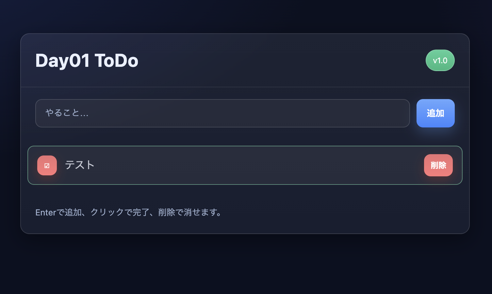

# Day01 ToDo ✅

100日チャレンジ（AI × Webアプリ開発）の Day 1 作品です。  
シンプルな ToDo アプリで、タスクの追加・完了・削除ができます。  
データは localStorage に保存され、ブラウザを閉じても残ります。

---

## 🚀 Demo
👉 [公開ページはこちら](https://fsonhub-bit.github.io/day01-todo/)

---

## 📖 使い方
1. 入力欄にタスクを入力して **Enter** または「追加」ボタン  
2. チェックボタンで **完了/未完了** を切り替え  
3. 「削除」ボタンでタスクを消去  

---

## 💡 学んだこと
- localStorage を使ってブラウザにデータを保存できること  
- DOM 操作とイベントリスナーの基本サイクル  
- GitHub Pages を使ってアプリを公開する手順  

---

## 🔧 改善したいこと
- 完了/未完了フィルタを追加したい  
- モバイル向けに UI を調整したい  
- ダーク/ライトテーマ切り替えを入れてみたい  

---

## 📝 License
MIT